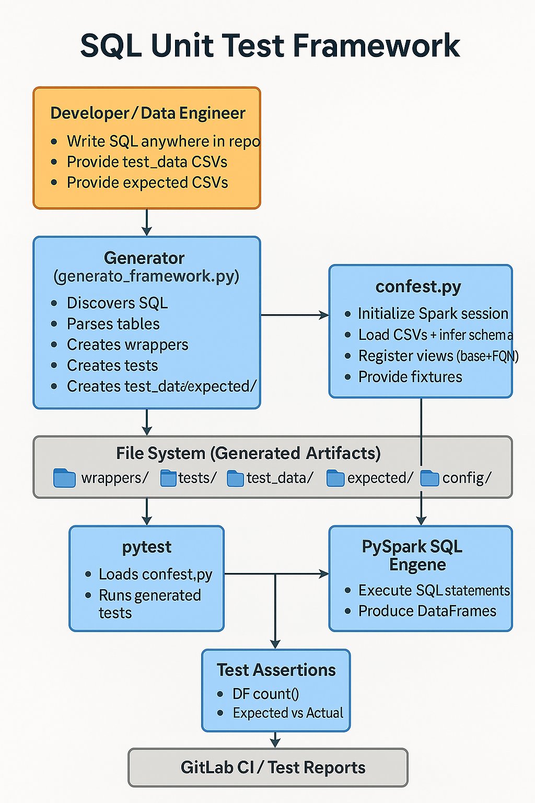
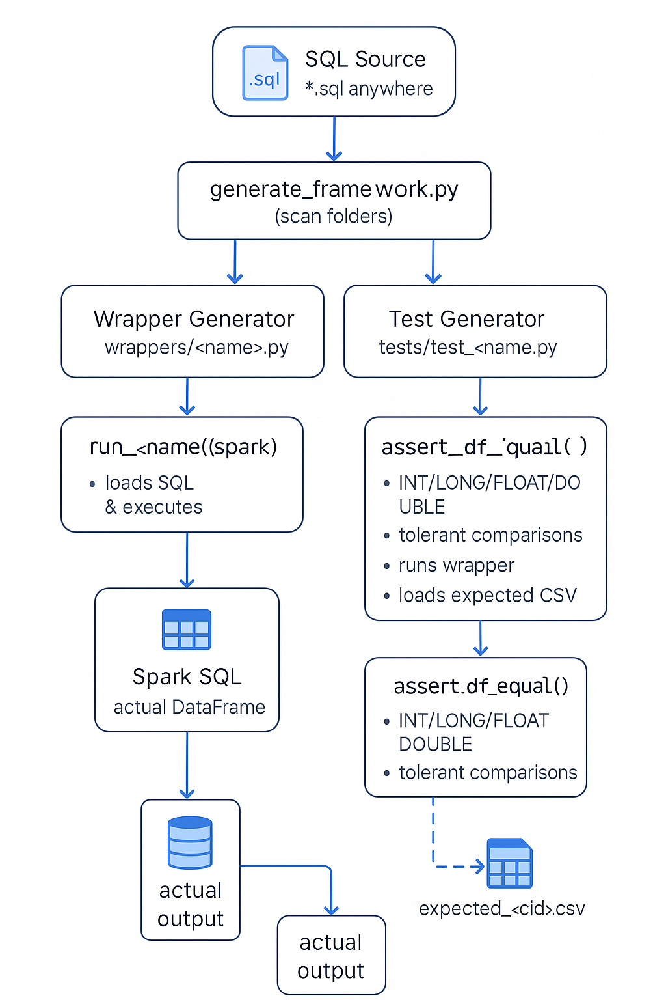

#  **PySpark SQL Unit Test Framework**

**Automated SQL Unit Testing with CSV Inputs, Multi-Case Support, Schema Inference & PySpark Execution**




---

# **Overview**

This framework provides **fully automated unit testing for SQL logic executed on PySpark**.
It allows teams to validate SQL transformations using **lightweight CSV input files**, powerful **schema inference**, and **auto-generated pytest tests** with bundled multi-scenario support.

The goal:

> **Zero manual efforts. You write SQL → The framework generates tests + wrappers automatically.**

The system supports:

* SQL files located **anywhere** in the repository
* CSV inputs (default + multiple case files)
* **Schema inference & normalization** (ensuring SQL never fails due to CSV typing issues)
* Fully-qualified table names (`db.schema.table`)
* Auto-registration of SQL tables as views
* Bundled scenario tests
* Optional expected outputs (golden datasets)
* GitLab CI pipeline support

---

# **High-Level Architecture**

```
SQL Files → Generator → Wrappers → Tests → Pytest + Spark → Compare Results → Reports/CI
```

---

# 🗁 **Folder Structure**

```
your_repo/
│
├── setup_framework.py                ← One-time generator script
│
├── sql/                              ← SQL source files (optional default root)
│     ├── calc_revenue.sql
│     ├── finance/
│     │      └── rollup.sql
│     └── hr/
│            └── employee_pay.sql
│
├── generator/
│     └── generate_framework.py       ← Auto-created generator
│
├── utils/                            ← Utility modules (assertions, loaders, parsers)
│     ├── __init__.py
│     ├── sql_loader.py
│     ├── sql_table_parser.py
│     ├── data_loader.py
│     ├── csv_schema_resolver.py
│     └── assertions.py               ← Numeric tolerant comparator (int/long/float/double)
│
├── wrappers/                         ← Auto-generated wrappers (DO NOT EDIT MANUALLY)
│     ├── src_finance_calc_revenue.py
│     ├── finance_rollup.py
│     └── hr_employee_pay.py
│
├── tests/                            ← Auto-generated test files + your Python tests
│     ├── test_src_finance_calc_revenue.py
│     ├── test_finance_rollup.py
│     ├── test_hr_employee_pay.py
│     ├── test_logic1.py              ← Your own Python tests
│     └── test_logic2.py
│
├── test_data/                        ← Input data + expected outputs for each SQL file
│     ├── src/finance/calc_revenue/
│     │       ├── employees.csv                 ← input table
│     │       ├── departments.csv               ← input table
│     │       ├── employees_case1.csv           ← case-specific input
│     │       ├── expected_default.csv          ← expected output for default
│     │       ├── expected_case1.csv            ← expected output for case1
│     │       └── expected_case2.csv            ← etc.
│     │
│     ├── finance/rollup/
│     │       ├── orders.csv
│     │       ├── expected_default.csv
│     │       └── expected_case1.csv
│     │
│     └── hr/employee_pay/
│             ├── salary.csv
│             ├── bonus.csv
│             └── expected_default.csv
│
├── conftest.py                        ← Shared Spark session for all tests
│
├── htmlcov/                           ← Coverage HTML output (created after pytest)
│
└── coverage.xml                       ← XML coverage output for CI/CD

```

---

#  **Key Features**

## 1️⃣ **SQL Auto-Discovery**

SQL files can be anywhere in the repo.

You can run the generator in two modes:

### Scan only specific folder

```
python generator/generate_framework.py --sql-root sql
```

### Scan entire repository

```
python generator/generate_framework.py --scan-all
```

The framework extracts:

* Table names
* Fully-qualified names
* Module key
* Folder structure for tests and inputs

---

## 2️⃣ **Auto-Generated Python Wrappers**

Each SQL file becomes a Python function:

```
def run_filter_employees(spark):
    sql = load_sql("src/etl/filter_employees.sql")
    return spark.sql(sql)
```

Stored under:

```
wrappers/<module_key>.py
```

---

## 3️⃣ **CSV Input-Driven Testing (Primary Input Format)**

### Default CSV per table:

```
employees.csv
departments.csv
```

### Multi-case scenario CSVs:

```
employees_case1.csv
employees_case2.csv
departments_case1.csv
```

### Missing case fallback:

Case missing? → automatically uses default CSV.

The framework NEVER skips a case due to missing case files.

---

## 4️⃣ **Schema Inference + Normalization**

CSV files are freeform (string-based).
Framework automatically:

* Infers column types
* Fixes inconsistent types
* Detects booleans, numbers, timestamps
* Adds missing columns
* Drops extra columns
* Ensures join keys match across tables
* Guarantees SQL can run without schema errors

This allows easy editing of CSVs without worrying about Spark typing rules.

---

## 5️⃣ **View Registration (Base + Fully-Qualified)**

If SQL contains:

```
SELECT * FROM db1.hr.employees
```

The framework registers both:

```
employees
`db1.hr.employees`
```

This ensures SQL runs unchanged.

---

## 6️⃣ **Generated Tests**

Two types:

### **A. Per-Table Tests**

Each table + each input case:

```
test_filter_employees_employees_default
test_filter_employees_employees_case1
test_filter_employees_departments_case1
```

Each test:

* Loads CSV input
* Normalizes schema
* Registers table view
* Runs SQL wrapper
* Asserts basic correctness

### **B. Bundled Scenario Tests**

Case ID = union of all table-specific cases.

Example:

* employees has case1
* departments has only default

Then:

```
bundle_case1 = employees_case1 + departments.csv
```

Test runs SQL with combined mapping.

---

## 7️⃣ **Optional Expected Output (Golden Dataset)**

Expected output files live under:

```
expected/<module_key>/
```

Example:

```
expected/src/etl/filter_employees/output.csv
expected/src/etl/filter_employees/output_case1.csv
```

If expected CSV exists:

* Load expected
* Normalize schema
* Sort both DFs
* Compare equality

If expected missing:

* Test still runs
* Output validation is skipped
* Warn developer:

```
WARNING: No expected output defined. Create expected/<module_key>/output.csv
```

---

## 8️⃣ **Global SparkSession (conftest.py)**

`conftest.py` creates:

* One Spark session for all tests (fast!)
* Preloads default CSV inputs for all SQL files
* Registers views **before** tests run

This accelerates testing, especially in CI pipelines.

---

## 9️⃣ **GitLab CI Integration**

`.gitlab-ci.yml` supports:

* Installing dependencies
* Running generator
* Running pytest
* Publishing test artifacts

---

# 🚀 **Using the Framework**

---

## **1. Install dependencies**

```
pip install -r requirements.txt
```

---

## **2. Place SQL files anywhere**

Example:

```
src/etl/hr/filter_employees.sql
dags/sql/join_salary.sql
```

---

## **3. Run Generator**

### To scan a specific folder:

```
python generator/generate_framework.py --sql-root src/etl/hr
```

### To scan entire repository:

```
python generator/generate_framework.py --scan-all
```

Generator will produce:

* wrappers/
* tests/
* test_data/
* expected/
* test_map.yaml

---

## **4. Provide CSV Inputs**

Under:

```
test_data/<module_key>/
```

Add:

```
employees.csv
employees_case1.csv
departments.csv
```

---

## **5. Add Expected Output (Optional)**

```
expected/<module_key>/output.csv
```

---

## **6. Run Tests**

```
pytest -q
```

You will see:

* Per-table tests
* Bundled tests
* Expected comparison tests

---

# 🧠 **How Schema Inference Works**

The framework samples CSV rows to guess column types:

| Value Example   | Inferred Type |
| --------------- | ------------- |
| `123`           | INT           |
| `12.5`          | DOUBLE        |
| `true`, `false` | BOOLEAN       |
| `2024-01-01`    | TIMESTAMP     |
| anything else   | STRING        |

Then it casts columns to consistent Spark types before running SQL.

---

# 🔍 **Example Scenario**

SQL file:

```
SELECT e.emp_id, d.dept_name
FROM employees e
JOIN departments d ON e.dept_id = d.dept_id
```

CSV input:

```
test_data/src/etl/filter_employees/
    employees.csv
    employees_case1.csv
    departments.csv
```

Generated tests:

```
test_filter_employees_per_table
test_filter_employees_bundle_case1
```

---

# 🧩 **Extensibility**

You can:

* Switch CSV to Parquet
* Add custom type inference
* Add expected output mapping from metadata CSV
* Extend SQL parsing
* Integrate with dbt or Airflow

---

# 📚 **Troubleshooting**

| Issue                            | Cause                | Solution                             |
| -------------------------------- | -------------------- | ------------------------------------ |
| SQL fails with “table not found” | Missing CSV input    | Add `<table>.csv`                    |
| Schema mismatch                  | CSV typing issue     | Schema inference handles; add header |
| No expected validation           | Missing expected CSV | Add under expected/<module_key>/     |
| No SQL discovered                | Wrong root folder    | Use `--scan-all`                     |

---

# 🏁 **Conclusion**

This framework gives you **powerful, automated, data-driven SQL testing** without writing manual test code.
Simply:

* Write SQL
* Prepare CSV inputs
* Run tests

Everything else is auto-generated and executed under PySpark.

---

